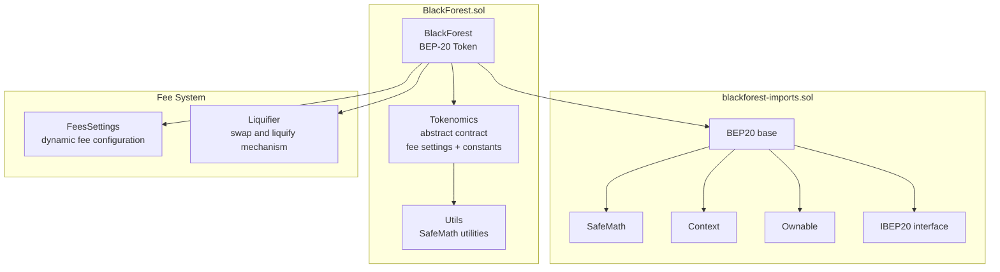
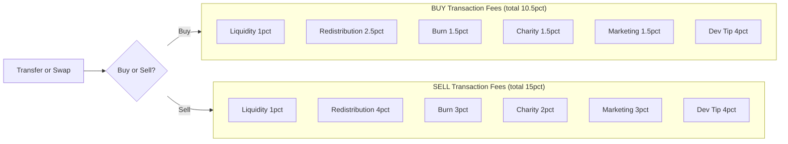
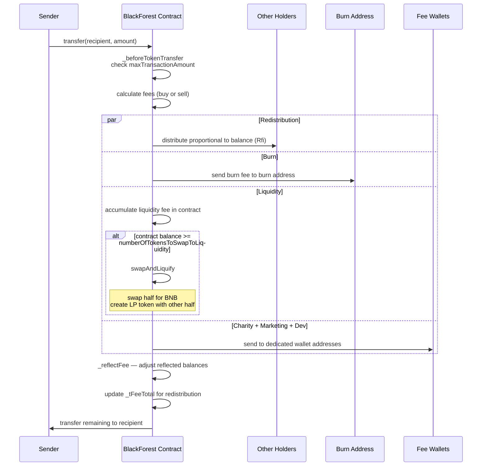
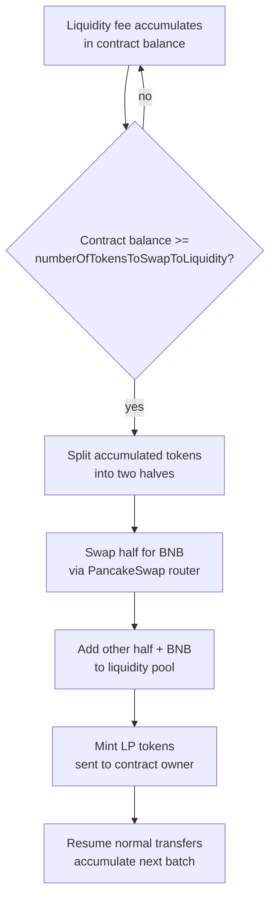
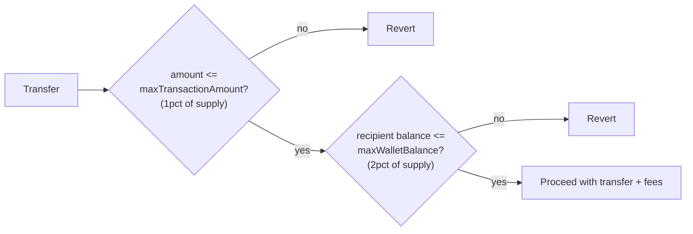
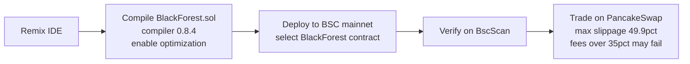

# BlackForest BSC-20 — Architecture

> A BEP-20 (BSC-20) token contract on the Binance Smart Chain. Features redistribution rewards, auto-liquidity, burn, and multiple fee categories with different rates for buy and sell transactions.

| | |
|---|---|
| **Network** | Binance Smart Chain (BSC) |
| **Standard** | BEP-20 (BSC-20) |
| **Compiler** | Solidity 0.8.4 with optimization |
| **Symbol** | BFT |
| **Decimals** | 9 |
| **Total Supply** | 1,000,000,000,000 (1 trillion) |
| **Max Transaction** | 1% of total supply |
| **Max Wallet Balance** | 2% of total supply |

---

## Contract Architecture



---

## Tokenomics — Fee Structure

Different fee rates apply to buy and sell transactions. Fees are deducted on each transfer and routed to their respective destinations.



---

## Transfer Flow with Fee Processing



---

## Redistribution Mechanism (Rfi)

The redistribution (Rfi) system rewards holders proportionally to their token balance. It uses a dual-balance system: `_rOwned` (reflected balances used for fee math) and `_tOwned` (true token balances for excluded accounts).

```mermaid
flowchart TD
  TX["Each transfer deducts Rfi fee"] --> REFLECT["_reflectFee"]
  REFLECT --> RATE["Calculate fee rate from rFee and tFee"]
  RATE --> ADJUST["_rOwned -= rFee for sender<br/>_rOwned += rFee for holders (proportional)"]
  ADJUST --> SUPPLY["_tFeeTotal += tFee<br/>_reflectedSupply -= rFee"]
  SUPPLY --> REWARD["All non-excluded holders<br/>gain proportional share<br/>automatically in their balance"]

  note right of REWARD
    Excluded accounts (contract, burn,
    charity, marketing, dev) use _tOwned
    and do NOT receive redistribution
  end note
```

---

## Swap and Liquify Mechanism



**Threshold:** `numberOfTokensToSwapToLiquidity` = 0.1% of total supply. Once the contract's token balance reaches this threshold, the next transfer triggers swap-and-liquify.

---

## Safety Limits



---

## Deployment


